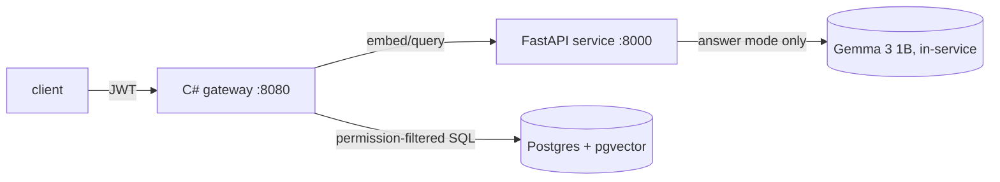

# Trust Layer

[](https://github.com/ctru0009/trustlayer/actions/workflows/ci.yml)
[](LICENSE)
[](python/pyproject.toml)
[](dotnet/global.json)
[](infra/docker-compose.yml)

Private semantic search over documents and screenshots: find things by meaning,
get sensitive items labelled, and never see something you are not allowed to see.
I built it to answer one question: how much of "private semantic search" is the
model, and how much is the plumbing around it? Turns out, mostly plumbing. The
retrieval benchmark and the leak test taught me more than any model ever did.

```bash
make setup && make test   # both stacks build and pass
make up                   # Postgres + pgvector, healthy
make stack                # full API: gateway on :8080
```

Then ask something:

```bash
TOKEN=$(curl -s -X POST localhost:8080/auth/login \
  -H 'Content-Type: application/json' \
  -d '{"username":"alice"}' | jq -r .token)

curl -X POST localhost:8080/ask \
  -H "Authorization: Bearer $TOKEN" \
  -H 'Content-Type: application/json' \
  -d '{"query":"budget forecast","mode":"fast","top_k":2}'
```

```json
{
  "results": [
    {
      "doc_id": "train:d074366b",
      "title": "19 Month Forecast Review",
      "score": 0.795,
      "label": "internal"
    },
    {
      "doc_id": "train:d4a1caa5",
      "title": "Operations Rebates",
      "score": 0.781,
      "label": "internal"
    }
  ],
  "answer": null,
  "citations": [],
  "latency_ms": { "embed": 1085.2, "search": 348.5, "llm": 0, "total": 1455.7 }
}
```

That transcript is real output from the stack running on my Mac, trimmed for
readability. Three things worth noticing: every hit carries a sensitivity label,
the response tells you exactly where the time went, and nothing in it required
trusting a probability with an access decision. Permissions live in C# and SQL,
where randomness cannot reach them.

## Why this exists

I am a software engineer (TypeScript, C#, Postgres) teaching myself ML and big
data. This repo is the project I learn with, and I keep the notes in the open:
every phase has a lesson in [`docs/learnings/`](docs/learnings/phase1.md) that
records what I actually understood, including the mistakes. The plan is in
[`docs/roadmap.md`](docs/roadmap.md), the design in [`docs/spec.md`](docs/spec.md).

## What it does

- **Ask by meaning.** `POST /ask` embeds the query (EmbeddingGemma-2,
  SearchQuery prompt) and ranks 23,317 chunks by cosine similarity. Fast mode
  returns cited passages; answer mode grounds a Gemma 3 1B answer in the
  permitted passages only, with 1:1 citations.
- **Labels sensitivity.** `POST /classify` returns public/internal/confidential
  with probabilities. The shipped model is logistic regression on frozen
  Classification-prefix embeddings: 94% of the fine-tuned DistilBERT F1 at zero
  inference cost and far better calibration. A confidential flag means "a human
  should look", not "this is confidential". Precision there is 0.27 and I say
  so up front.
- **Enforces permissions before retrieval.** The ACL predicate is part of the
  SQL query, then every hit is re-checked in application code. The LLM only
  receives passages that passed both. The leak test asserts zero violations
  across every user and every evaluation query: 0/69,160 direct, 0/840 through
  the API in both modes. Carol (Everyone-only) asking about layoffs gets public
  and internal hits only, and a direct fetch of a confidential document returns
  404, identical to a missing one.
- **Searches images too.** 50 FUNSD forms share the same index as the text.
  Query words match form content cross-modally.

## Results

300 frozen queries (150 subjects + 150 held-out chunks, test split) against
23,317 chunks. Recall@10 / MRR@10, bootstrap 95% CIs, CPU latencies. Full
provenance per run in `data/bench/results/` (git-ignored; regenerate with
`make bench`); method in [`docs/learnings/phase6.md`](docs/learnings/phase6.md).

| Config | R@10 | MRR | p50 | Index |
|---|---|---|---|---|
| baseline (768d fp32, exact) | 0.977 | 0.911 | 31ms | 100MB |
| O1 512d | 0.977 | 0.911 | 29ms | 69MB |
| O2 256d | 0.973 | 0.895 | 5.5ms | 29MB |
| O3 128d | 0.940 | 0.860 | 4.4ms | 16MB |
| O5 HNSW (ef_search=40) | 0.900 | 0.838 | 2.1ms | 193MB |
| O6 halfvec | 0.977 | 0.911 | 7.5ms | 40MB |
| **O7 256d + halfvec (ship this)** | **0.970** | **0.894** | **4.5ms** | **16MB** |
| query-mismatch ablation | 0.963 | 0.886 | 37ms | 100MB |

Cross-lingual (500-article Vietnamese Wikipedia sample): EN→VI MRR 0.954,
VI→VI MRR 0.985. Same recall, slightly worse cross-lingual ranking.


The headline: truncating to 256 dimensions plus half-precision storage keeps
99% of baseline recall in one-sixth of the space. HNSW buys 15x latency at a
real quality cost (minus 0.077 recall), so the shipped config stays exact.

Classifier comparison (5 methods, same 200 gold items, public 64 / internal
119 / confidential 17):

| Method | Macro-F1 | P-con / R-con | ECE | p50 |
|---|---|---|---|---|
| DistilBERT fine-tuned (T4) | 0.598 | 0.27 / 1.00 | 0.37 | 6ms |
| LR on frozen cls embeddings | 0.560 | 0.26 / 0.88 | 0.14 | ~0ms |
| Gemma 3 1B zero-shot | 0.435 | 0.23 / 0.53 | 0.40 | 357ms |
| Decision Maker Laya zero-shot | 0.393 | 0.29 / 0.12 | 0.10 | 80ms |


The honest story: trained methods catch confidential items but cry wolf
(precision ~0.27 everywhere, inherited from weak-label rules that over-fire on
the word "confidential"). Best F1 does not mean most trustworthy probabilities:
DistilBERT wins F1 and is badly miscalibrated (ECE 0.37). Per-class detail,
confusion matrices, and 8 analysed errors in
[`docs/learnings/phase7.md`](docs/learnings/phase7.md).

## Architecture



Python does data and models. C# decides who may see what. Postgres holds
vectors, metadata, and ACL columns. Each component has an explicit must-not
(spec §4): the model service knows nothing about users, the gateway runs no
models, the database is never the only permission check. Request IDs flow
gateway to service and into every log line; [`docs/architecture.md`](docs/architecture.md)
has the full runtime map.

## Getting started

You need Docker, the .NET 10 SDK, and Java 17 or newer (Java is for PySpark;
`uv` fetches the pinned Python 3.12 itself).

```bash
make setup   # install Python and .NET dependencies
make test    # run both test suites (68 pytest + 35 xUnit)
make up      # start Postgres + pgvector, wait until healthy
make down    # stop it
```

The full pipeline (`make prep`, `make labels`, `make embed`, ...) downloads
public datasets via scripts in `data/scripts/` and needs a `DATABASE_URL`.
Details per phase live in the roadmap and the per-phase lessons.

## API sketch

| Endpoint | Auth | Purpose |
|---|---|---|
| `POST /auth/login` | no | Demo login (alice, bob, carol, admin; no passwords) |
| `GET /health` | no | Liveness + dependency status |
| `POST /ask` | yes | Search (`fast`) or grounded answer (`answer`) |
| `POST /classify` | yes | Label text or a stored document (ACL-checked) |
| `GET /documents/{id}` | yes | Fetch a document (ACL-checked, 404 if invisible) |

The Python service (`:8000`, internal) exposes `/embed`, `/classify`,
`/decide`, `/answer`, `/health`. It takes raw content and returns model
output. No user fields exist anywhere in that module, on purpose.

## Limitations

- 23k chunks on one machine. Latency and index numbers do not predict scale.
- Retrieval judgments are single-relevant (recall = hit@10); chunk-generated
  queries favour easy documents. O4 (GGUF quantisation) is blocked: released
  llama.cpp cannot load this model's architecture yet.
- The gold set is 200 items, agent-reviewed, with 17 confidential positives.
  Confidence intervals there are wide. The most valuable validation left is a
  human re-review of the 77 overruled items.
- Classifier confidential precision (~0.27) rules out automated gating. Flags
  route to humans.
- Answer mode runs Gemma on CPU: seconds per answer natively, minutes
  in-container. Fine for a demo, not for production.
- Audio is a stretch phase, unbuilt and unpromised.

## What I would do next

Human gold review first, then a Gradio demo over the gateway (Phase 9), then a
90-second demo video (Phase 10). Longer term: temperature scaling for the
miscalibrated rows, Phase 6 variant tables wired into the gateway so dimension
is negotiated instead of pinned, and the audio stretch if phases 1 to 10 hold
up. The cut list in the roadmap says what goes first if time runs short.

## Contributing

Small, focused PRs. See [CONTRIBUTING.md](CONTRIBUTING.md) for the workflow,
and [SECURITY.md](SECURITY.md) for reporting anything sensitive. Please do not
open PRs that add audio, a frontend framework, or coverage tooling: those are
explicit non-goals.

## Licence

MIT — see [`LICENSE`](LICENSE). Data sources and their licences are recorded in
[`data/SOURCES.md`](data/SOURCES.md); no data is committed to this repository.
