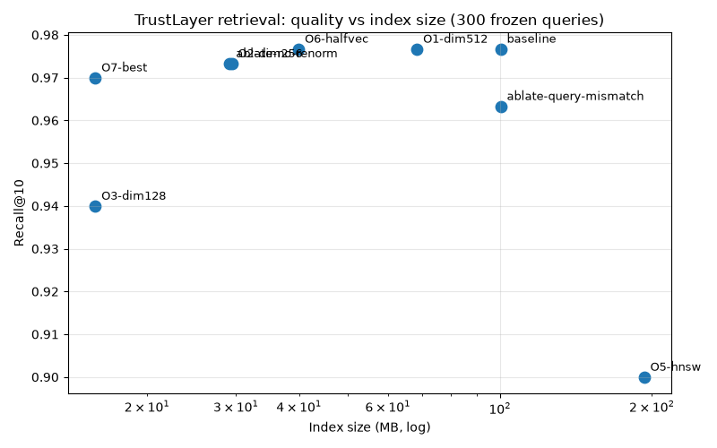
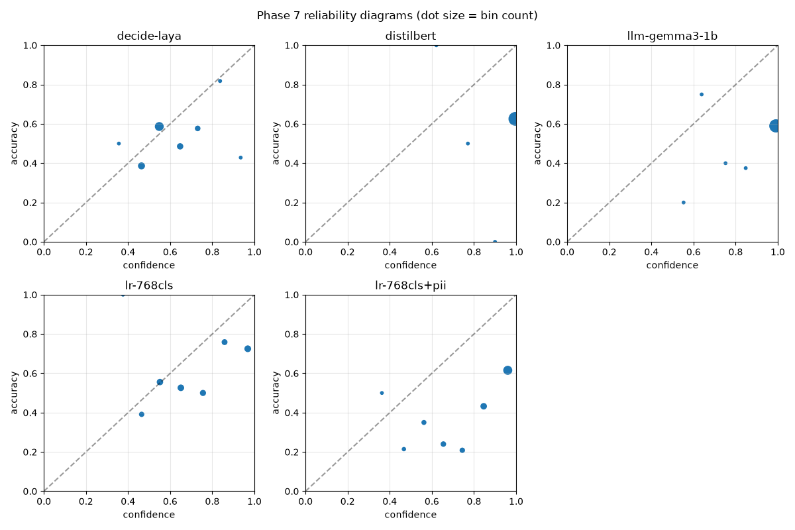

# Trust Layer

A private, local search experiment: I want to find documents and screenshots by meaning, have
sensitive items labelled, and be confident a search never returns something I am not allowed to see.

I am a software engineer (TypeScript, C#, Postgres) teaching myself ML and big data, and this is the
project I am learning it with. The question I am starting from: how much of "private semantic search"
is the model, and how much is the plumbing around it — access control, evaluation and data handling?

## Status

Phase 8 of 11. The pipeline runs end to end behind a real API: PySpark prep
→ weak labels → EmbeddingGemma-2 embeddings (23k text + 50 image vectors in
pgvector) → permission-filtered search with a zero-violation leak test
(0/69,160 direct, 0/840 through the API) → audited retrieval benchmark →
classifier comparison. FastAPI model service + C# gateway (`/ask` fast and
answer modes). No demo or video yet.

The plan, with exit criteria per phase, is in [`docs/roadmap.md`](docs/roadmap.md);
the design is in [`docs/spec.md`](docs/spec.md); per-phase lessons (what I actually
understood) are in [`docs/learnings/`](docs/learnings/phase1.md).

## Retrieval results (Phase 6)

300 frozen queries (150 subjects + 150 held-out chunks, test split) against
23,317 chunks. Recall@10 / MRR@10, bootstrap 95% CIs, CPU latencies. Full
provenance per run in `data/bench/results/`; method in
[`docs/learnings/phase6.md`](docs/learnings/phase6.md).

| Config | R@10 | MRR | p50 | Index |
|---|---|---|---|---|
| baseline (768d fp32, exact) | 0.977 | 0.911 | 31ms | 100MB |
| O1 512d | 0.977 | 0.911 | 29ms | 69MB |
| O2 256d | 0.973 | 0.895 | 5.5ms | 29MB |
| O3 128d | 0.940 | 0.860 | 4.4ms | 16MB |
| O5 HNSW (ef_search=40) | 0.900 | 0.838 | 2.1ms | 193MB |
| O6 halfvec | 0.977 | 0.911 | 7.5ms | 40MB |
| **O7 256d + halfvec (ship this)** | **0.970** | **0.894** | **4.5ms** | **16MB** |
| query-mismatch ablation | 0.963 | 0.886 | 37ms | 100MB |

Cross-lingual (500-article Vietnamese Wikipedia sample): EN→VI MRR 0.954,
VI→VI MRR 0.985 — same recall, slightly worse cross-lingual ranking.



Limits: single-relevant judgments (recall = hit@10); chunk queries favour
easy docs; 23k-row latency doesn't predict scale. O4 (GGUF) blocked:
released llama.cpp can't load this model's architecture yet.

## Classifier results (Phase 7)

Five methods on the same 200 gold items (public 64 / internal 119 /
confidential 17); train = 16,720 weak-labelled chunks minus all gold
threads. Per-class P/R, confusion matrices, ECE + reliability plot, and
8 analysed errors in [`docs/learnings/phase7.md`](docs/learnings/phase7.md);
provenance per row in `data/classify/results/`.

| Method | Macro-F1 | P-con / R-con | ECE | p50 |
|---|---|---|---|---|
| DistilBERT fine-tuned (T4) | 0.598 | 0.27 / 1.00 | 0.37 | 6ms |
| LR on frozen cls embeddings | 0.560 | 0.26 / 0.88 | 0.14 | ~0ms |
| Gemma 3 1B zero-shot | 0.435 | 0.23 / 0.53 | 0.40 | 357ms |
| Decision Maker Laya zero-shot | 0.393 | 0.29 / 0.12 | 0.10 | 80ms |

What I would ship: LR — 94% of DistilBERT's F1 at zero inference cost
with far better calibration (ECE 0.14 vs 0.37). Neither is deployable as
a gate: confidential precision is ~0.27 everywhere (weak-label
rule-mimicry), so a flag means "human look", not "is confidential".



Limits: 17 confidential positives (wide CIs); agent-reviewed gold;
zero-shot wordings fixed a priori (no gold tuning).

## API (Phase 8)

FastAPI model service (port 8000, internal) + C# gateway (port 8080).
Demo users `alice`/`bob`/`carol`/`admin`, no passwords. Ask fast mode
returns cited passages; answer mode grounds a Gemma 3 1B answer in
permitted passages only. Every `/ask` response carries a latency
breakdown; leak test through the API: 0 violations over 840 hits.

```bash
make serve   # model service locally (uvicorn, CPU)
# gateway: cd dotnet/src/TrustLayer.Gateway && dotnet run --urls http://localhost:8080
make api-leak  # leak test through the API (needs stack + DATABASE_URL)
```

## Getting started

```bash
make setup   # install Python and .NET dependencies
make test    # run both test suites
make up      # start Postgres + pgvector, wait until healthy
make down    # stop it
```

You need Docker, the .NET 10 SDK, and Java 17 or newer (Java is for PySpark in Phase 2; `uv` fetches
the pinned Python 3.12 itself). [`docs/architecture.md`](docs/architecture.md) has the details.

## Why two languages

Python for the data and model work, C# for the gateway that decides who may see what. I want the
permission logic to live somewhere a probability cannot reach it — the reasoning is in section 8 of
[`docs/spec.md`](docs/spec.md).

## Licence

MIT — see [`LICENSE`](LICENSE). Data sources and their licences are recorded in
[`data/SOURCES.md`](data/SOURCES.md); no data is committed to this repository.
