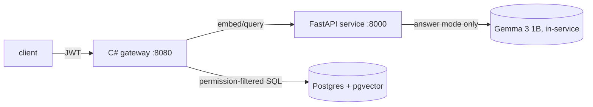

# Architecture

How the running pieces fit together (written in Phase 8, when there was
something to describe). Component responsibilities and must-nots are in
[`spec.md`](spec.md) §4; this file is the request flow and the runtime map.

## Request flow



`/ask` fast: gateway → service `/embed` (query vector) → pgvector search
with the ACL predicate in the SQL → re-check every hit in C# → ranked
passages + latency breakdown. Answer mode adds one service `/answer`
call over the permitted passages, with 1:1 citations. The LLM never
sees unpermitted text — it only receives passages that passed both
checks (spec §8.4).

`/classify` (text): gateway → service `/classify` (Classification-prefix
encode + exported LR weights). With `doc_id`: gateway fetches the doc,
404s when missing *or* invisible (identical response — existence is
never revealed), then classifies title + chunks.

## Runtime map

| Piece | Runs as | Port | Needs |
|---|---|---|---|
| Postgres + pgvector | compose `db` (`make up`) | 5432 | Docker |
| Model service | `make serve` or compose `service` | 8000 | embed+classify extras, ~2GB weights on first use |
| Gateway | `dotnet run` or compose `gateway` | 8080 | `Jwt:Secret`, `ConnectionStrings:TrustLayer`, `ModelService:BaseUrl` |

Compose profiles: default = `db` only; `stack` adds service + gateway
(`make stack`). The service image carries torch CPU, so it stays out of
the default path. Model/HF caches persist in the `modelcache` volume.

## Trust boundaries

- The model service knows nothing about users or permissions — no user
  field exists in `trustlayer/service/`. ACL enforcement is gateway-only.
- Decisions (labels, answers) may *inform* display; access control is
  always deterministic code (SQL predicate + `Acl.Visible` re-check),
  never a probability (spec §9).
- JWT secret: dev default in `appsettings.Development.json` only;
  non-Development refuses to start without `Jwt:Secret` configured.

## Pinned toolchain

| Piece | Pin | Where |
|---|---|---|
| Python | 3.12 | `python/pyproject.toml` (`requires-python`), `python/.python-version` |
| Python dependencies | locked | `python/uv.lock` |
| .NET | 10 (LTS) | `dotnet/global.json` |
| Postgres + pgvector | 18 + 0.8.7 | `infra/docker-compose.yml` |
| Service web | fastapi 0.142.4, uvicorn 0.54.0, httpx 0.28.1 | `python/pyproject.toml` (`service` extra) |
| Gateway web | JwtBearer 10.0.12, Npgsql 10.0.3, Mvc.Testing 10.0.12 | `dotnet/**/*.csproj` |

## Local preconditions

- **Docker** with Compose v2 — for Postgres.
- **.NET 10 SDK** — for the gateway and its tests.
- **`uv`** — resolves and installs the pinned Python itself, so the system `python3` does not matter.
- **Java 17 or newer for PySpark** (Phase 2). PySpark 4.x requires it, and Spark 4.x is tested
  against Java 17 and 21. Homebrew's `openjdk@21` is keg-only, so PySpark will need an explicit
  `JAVA_HOME`:

  ```bash
  export JAVA_HOME="$(brew --prefix openjdk@21)/libexec/openjdk.jdk/Contents/Home"
  ```
