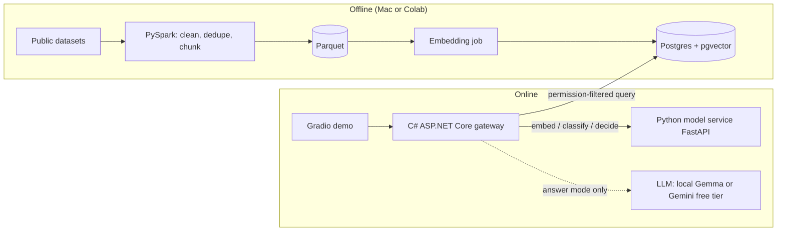

# Trust Layer: Specification (v0.1)

> Working title. A learning project exploring what a small, open multimodal embedding model can do for private search, sensitivity detection and permission-aware retrieval, and how to measure the trade-offs honestly.

## 1. Purpose and learning goals

I wanted to understand, end to end, how modern embedding-based systems are built and evaluated. This project is a hands-on way to learn:

1. How embeddings, vector search and retrieval quality work in practice (not just in theory).
2. How to measure quality, speed, memory and calibration, and how to avoid fooling yourself (data leakage, label noise, silent numerical failures).
3. How to enforce access control *before* retrieval so a search system cannot leak documents to the wrong user.
4. How to split a system across Python (data and models) and C# (API and security logic).
5. How to run heavy jobs on free or cheap compute (Colab) while keeping everything reproducible on a laptop.

**One-line pitch:** a private, on-device search for documents and screenshots that finds things by meaning, flags sensitive items, and never shows a user something they are not allowed to see.

## 2. Non-goals

- Not a production system. No Kubernetes, no microservices sprawl, no multi-region anything.
- No private or customer data. Public datasets only.
- No training an embedding model from scratch. (Optional fine-tuning is out of scope for v1.)
- No polished front end. A small Gradio demo and API docs are enough.
- Audio is a **Phase 2 stretch**. It is not part of v1 and is not promised anywhere in the README until built and measured.

## 3. Scenarios

| # | Scenario | What success looks like |
|---|---|---|
| S1 | A user asks a question in plain language | Relevant passages come back, ranked, with citations, in milliseconds |
| S2 | A user searches for a scanned document with words from its content | The matching image is returned, even though no text was indexed for it separately |
| S3 | A document contains personal or confidential information | It is labelled with a probability, and the label is explainable from evaluation results |
| S4 | A user without access searches for the same content | Nothing from restricted documents is returned or hinted at |
| S5 | A user asks in Vietnamese about English documents (and the reverse) | Results are relevant, and the quality gap vs same-language search is measured |
| S6 | A user wants a written answer | Answer mode returns an LLM answer built only from the permitted, cited passages |

## 4. System overview



### Responsibilities

| Component | Language | Owns | Must not |
|---|---|---|---|
| Data prep | Python (PySpark) | Cleaning, dedup, chunking, Parquet output | Touch the database directly |
| Embedding job | Python | Batch embeddings, resume after interruption, finite-value checks | Run in float16 |
| Model service | Python (FastAPI) | `/embed`, `/classify`, `/decide`; model loading; prefixes | Know about users or permissions |
| Gateway | C# (ASP.NET Core) | Auth, users/roles, ACL enforcement, retrieval SQL, `/ask`, `/classify`, rate limits | Run models |
| Database | Postgres + pgvector | Vectors, metadata, ACL columns, indexes | Be the only place permissions are checked (see section 8.4) |
| Demo UI | Python (Gradio) | A thin client over the gateway | Contain business rules |

## 5. Data

All sources are public. Check each licence and availability before use, and record the exact version and licence in `data/SOURCES.md`.

| Need | Source | Handling |
|---|---|---|
| Small dev text | AESLC (Enron subset, Hugging Face) | Use for fast iteration |
| Full text at scale | Enron email corpus (Kaggle `wcukierski/enron-email-dataset`, or the CMU original) | **Real people's emails.** Download via script only. Never commit raw data. Never publish individual emails in demos or screenshots |
| PII ground truth | A labelled synthetic PII dataset (ai4privacy family on Hugging Face; confirm name, languages, licence) | Gives genuine labels instead of weak ones |
| Images | RVL-CDIP or FUNSD | Subsets of 2k to 5k |
| Vietnamese text | Vietnamese Wikipedia (`wikimedia/wikipedia`) | Share-alike licence; credit it |
| Audio (Phase 2) | FLEURS (Hugging Face) | Same sentences in English and Vietnamese |

**Rules**

- `data/` is git-ignored. Only download scripts and small hand-made fixtures are committed.
- Synthetic users, roles and ACLs are generated by a seeded script so results are reproducible.
- Dedupe near-duplicates and **split by email thread** before any training or evaluation to avoid leakage.

## 6. Model and embedding rules

Model: `google/embeddinggemma-2` (open, multimodal, 740M parameters in total: 270M text, 170M vision, 300M audio; 8,192-token shared context). Always verify behaviour against the current model card.

| Rule | Why |
|---|---|
| Never use float16. Use float32 by default; use bfloat16 only where verified on the hardware | The model card warns of NaN or silently degraded embeddings in float16 |
| Check every batch for NaN/Inf and the expected dimension before writing | Failures are silent otherwise |
| Use the task prefixes: `SearchQuery` for queries, `Document` (or `title: ... | text: ...`) for corpus items; `Classification` for classifiers | Quality drops silently without them |
| L2-normalise after any truncation (768, 512, 256, 128) | Slicing breaks unit length |
| Queries and documents must use the same dimension | Otherwise scores are meaningless |
| Load only the encoders needed (text-only about 270M, text+image about 440M) | Memory |
| Embed once at 768d, derive smaller dimensions by truncating in NumPy | Saves compute; the benchmark uses this |

### Hardware profiles

| Profile | Role | Notes |
|---|---|---|
| Mac mini M4, 16GB unified RAM | Primary development | Text-only fp32 is about 1.1GB and text+image about 1.8GB of weights, so both fit comfortably. Spark, Postgres and Docker share the same 16GB, so run heavy jobs one at a time. PyTorch `mps` backend must be verified (NaN check against a CPU float32 reference) before use |
| Colab (paid units) | Bulk embedding, repeated benchmark runs | Notebooks are thin: clone repo, install, run a module, save to Drive after every chunk, disconnect when done |
| Other laptop (CPU or small GPU) | Fallback | Must work via Docker Compose and CPU-only paths, just slower |

## 7. Functional requirements

| ID | Requirement | Verified by |
|---|---|---|
| F1 | PySpark job cleans, dedupes and chunks the corpus into Parquet | Row counts and dedup stats logged; unit tests on transforms |
| F2 | Documents carry sensitivity labels; 200 hand-checked items form a frozen gold test set | Gold file committed (fixtures only), labelling notes in `LEARNING.md` |
| F3 | Embedding pipeline is resumable, chunked, prefix-correct, normalised and finite-checked | Kill-and-resume test; NaN test |
| F4 | pgvector stores chunk vectors with ACL and label columns | Schema migration tests |
| F5 | `/ask` offers **fast mode** (cited passages only) and **answer mode** (LLM answer from permitted passages only) | API tests; latency recorded for both |
| F6 | `/classify` returns label, probabilities and method used | API tests |
| F7 | Permission filtering happens **before** retrieval results reach the caller or the LLM | Leak test (section 12) |
| F8 | Cross-lingual (Vietnamese/English) search works and the gap is measured | Benchmark section |
| F9 | Text and image retrieval share one index | Retrieval tests with image gold queries |
| F10 | Everything runs locally via Docker Compose and Make targets | Fresh-clone smoke test in CI |

## 8. API and security design

### 8.1 Users and permissions (synthetic)

- Users: `alice` (HR), `bob` (Finance), `carol` (Everyone), `admin`.
- Document ACL: `allowed_roles text[]`, plus a `label` of `public | internal | confidential`.
- Rule: a user may see a document if one of their roles is in `allowed_roles`. Confidential documents additionally require an explicit role grant (never inherited from `Everyone`).

### 8.2 Gateway endpoints (C#)

| Method and path | Purpose | Notes |
|---|---|---|
| `POST /auth/login` | Demo login returning a JWT | Demo users only |
| `GET /health` | Liveness and dependency check | No auth |
| `POST /ask` | Search and optional answer | Body below |
| `POST /classify` | Classify text or a stored document | Respects ACL when given `doc_id` |
| `GET /documents/{id}` | Fetch a document | ACL enforced |

`POST /ask` request:

```json
{ "query": "string", "mode": "fast", "top_k": 10, "dimension": 768 }
```

Response:

```json
{
  "results": [
    { "doc_id": "string", "chunk_id": "string", "title": "string",
      "snippet": "string", "modality": "text|image", "score": 0.0, "label": "internal" }
  ],
  "answer": null,
  "citations": [],
  "latency_ms": { "embed": 0, "search": 0, "llm": 0, "total": 0 }
}
```

`answer` and `citations` are only populated in `answer` mode. Errors never reveal whether a restricted document exists.

### 8.3 Python model service (internal, not exposed publicly)

| Path | Purpose |
|---|---|
| `POST /embed` | Texts or images in, normalised vectors out (dimension selectable) |
| `POST /classify` | Label and probabilities (logistic regression on embeddings, plus other methods for benchmarking) |
| `POST /decide` | Structured Choice/Boolean/Score questions via MediaPipe Decision Maker |
| `GET /health` | Includes model name, dtype, device |

### 8.4 Defence in depth

1. The gateway adds the permission predicate to the SQL query itself (pre-filter), not after ranking.
2. Results are re-checked in application code before returning.
3. The LLM only ever receives passages that passed both checks.
4. Note: filtered approximate (HNSW) search can return fewer results than requested. Check the pgvector version's behaviour, test recall under filtering, and document it.

### 8.5 Database sketch

```
documents(id, source, title, modality, lang, thread_id, label, allowed_roles text[], created_at)
chunks(id, doc_id, ord, text, embedding vector(768))
-- optional benchmark variants: truncated vectors, half-precision storage, HNSW parameters
```

## 9. Classification and decisions

Compared on the **same gold set and splits**:

| Method | Training | Notes |
|---|---|---|
| Logistic regression on frozen embeddings | Yes (cheap) | Uses the `Classification` prefix |
| Fine-tuned DistilBERT | Yes | PyTorch; Colab |
| LLM zero-shot | No | Cost and latency recorded |
| MediaPipe Decision Maker (EmbeddingGemma 2 backend) | No | Choice/Boolean/Score primitives; verify the listed float16 build for NaN and compare against float32; verify it runs on macOS |

Report precision, recall, F1, confusion matrices, latency, cost per 1,000 documents, and **calibration** (reliability diagram, expected calibration error). Include 5 to 10 analysed error examples.

Decisions may *label* documents. Access control is always enforced by deterministic code, never by a probability.

## 10. Benchmark specification

**Baseline:** text-only EmbeddingGemma 2, float32, 768d, correct prefixes, normalised, exact cosine search.

Change one thing per row:

| ID | Change | Saves |
|---|---|---|
| O1 to O3 | Truncate to 512, 256, 128 dims (re-normalise) | Storage, search time |
| O4 | GGUF-quantized text model via llama.cpp | Model memory, maybe latency |
| O5 | HNSW instead of exact search | Query latency at scale |
| O6 | Half-precision vector storage (if supported by the pgvector version) | Index size |
| O7 | Best combination | The recommended configuration |

**Silent-failure ablations:** no re-normalisation; no prefixes.

**Cross-lingual:** Vietnamese-to-English and English-to-Vietnamese vs same-language retrieval.

**Metrics:** recall@10, MRR@10, nDCG@10; model memory; index size; docs per second; p50 and p95 query latency; Colab units per 10k documents.

**Protocol**

1. Freeze the query set and gold labels before experimenting. Hand-check at least 100 queries.
2. Keep a dev set for debugging and a held-out test set for the final table.
3. Timing: warm-up, then at least 5 repeats, report median and spread. Never mix laptop and Colab numbers in one row.
4. Bootstrap confidence intervals over queries.
5. Log config per run: model version, dtype, dimension, prefixes, seed, library versions, device, date.
6. Check all vectors are finite before indexing any run.

**Deliverables:** a results table, a quality-vs-size Pareto plot, and a written "what I would ship and why" section.

**Limits to state:** queries are LLM-generated (they favour easy documents), small-corpus latency does not predict scale, and results are specific to this data.

## 11. Non-functional requirements

- **Reproducible:** `make setup`, `make test`, `make up` work on a fresh clone. Versions pinned. Seeds fixed.
- **Portable:** the same repo runs on the Mac, another laptop, Colab (Python jobs) and CI.
- **Safe:** no secrets in git; `.env.example` only; no real personal data in fixtures, logs, screenshots or demos.
- **Honest:** every number in the README links to a run log or notebook.
- **Observable:** structured logs with request IDs; latency breakdown in `/ask` responses.

## 12. Testing

| Layer | Tests |
|---|---|
| Python | pytest: transforms, prefix handling, normalisation, finite checks, metric functions |
| C# | xUnit: auth, ACL predicate, API contracts |
| **Leak test** | For every synthetic user and every query in the evaluation set, assert **zero** returned documents they are not allowed to see, in both modes |
| Resume test | Interrupt an embedding job and confirm it resumes without duplicates |
| Smoke | CI builds both stacks and runs the test suites; a compose-based end-to-end check on a tiny fixture |

## 13. Acceptance criteria

1. Leak test passes with zero violations.
2. All stored embeddings are finite with the expected dimension.
3. README contains the results table, Pareto plot, and "what I would ship" section.
4. A limitations section is present.
5. `LEARNING.md` has own-words notes for every phase.
6. A demo video of 90 seconds or less plus screenshots or GIF frames show: ask, classify, and a permission block.
7. A fresh clone can reproduce the small-fixture pipeline using documented commands.

## 14. Repository layout

```
trust-layer/
  README.md
  LEARNING.md
  docs/ spec.md roadmap.md architecture.md
  data/ SOURCES.md scripts/ (downloads only; data itself is git-ignored)
  python/
    pyproject.toml
    src/trustlayer/ (prep, embed, classify, decide, bench, service)
    tests/
  dotnet/
    TrustLayer.sln
    src/TrustLayer.Gateway/
    tests/TrustLayer.Gateway.Tests/
  notebooks/ (thin Colab wrappers only)
  infra/ docker-compose.yml, Dockerfiles, db/migrations
  demo/ app.py (Gradio)
  demo-video/ (isolated; fframes project; marked as documentation in .gitattributes)
  .github/workflows/ci.yml
  Makefile  .env.example  .gitignore  .editorconfig
```

## 15. README voice

First person, curious, specific. "I wanted to understand X, so I built Y and measured Z." Lead with a 30-second pitch, one screenshot or GIF, the results table and the headline finding. Put setup commands near the top, then architecture, then benchmark detail, then limitations and what I would do next. Do not oversell. Do not list unbuilt features as roadmap items.

## 16. Risks

| Risk | Mitigation |
|---|---|
| Memory pressure with Spark, Postgres and models on 16GB | Run jobs sequentially; sample data; text-only encoder by default |
| `mps` numerical issues | Compare against a CPU float32 reference; fall back to CPU/Colab |
| Colab disconnects or runs out of units | Chunked, resumable jobs saved to Drive; time 1,000 docs first |
| Label noise inflates results | Use real PII labels where possible; hand-check 200; state limits |
| Filtered HNSW returns too few results | Test recall under filtering; document the fix |
| New model, few tutorials | Work from the model card; budget debugging time |
| Decision Maker float16 build gives bad vectors | NaN checks; compare to float32 |
| Rust toolchain for the video is painful | Isolate it; fall back to screen recording |
| Scope creep | Roadmap cut list; audio stays Phase 2 |

## 17. Open questions

- Exact name and licence of the PII dataset to use.
- Whether Decision Maker's Python package installs cleanly on macOS.
- pgvector version available in the chosen Docker image, and support for half-precision storage and iterative filtered scans.
- Which free LLM option (local Gemma vs a free API tier) to use for answer mode.